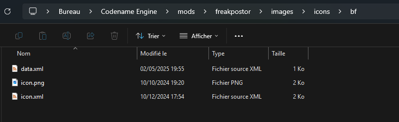

# Making Custom Icons

To start making your icon you need to see whenever it is animated or not

**Note:** If your icon doesn't need to be scaled nor flipped nor be antialiased nor to be animated you can just put your icon direcly in to ``./images/icons/`` and just named ``iconName.png`` (Replace it with your actual icon name btw)
And if you followed that note you dont need to read the rest since it needs and icon data which the old format doesnt have :P

Make a folder in ``./images/icons`` with the name of your icon and place it the png (and the xml if its animated) and then create a file named ``data.xml`` if you don't need to change specifications about the icon like default scale, facing direction and antialiasing.

**Important note:** The xml for the animated icon you be named ``icon.xml`` and the png should be named ``icon.png`` both these files should be your icon name folder alonside the data if you have/need one

If the icon is not animated
```xml
<!DOCTYPE codename-engine-icon>
<icon scale="1" facing="left" antialiasing="true" />
```

And for animated icons this is going to be different because every animated icon is different
```xml
<!DOCTYPE codename-engine-icon>
<icon scale="3" facing="left" antialiasing="false" offsetX="0" offsetY="0">
    <!-- adds an animation for type neutral with the anim idle0 with an y offset of -15 and not moving with fps=0 -->
    <anim name="neutral" anim="idle0" looped="false" offsetY="-15" fps="0"/>

    <!-- adds a transition from neutral to winning with a fps value of 10 fps and y offset of -15 -->
    <transition from="neutral" to="winning" anim="confirm0" fps="10" offsetY="-15"/>

    <!-- this sets the percentage from 0 to the next step (added later) to be specified as a neutral type -->
    <step percent="0" type="neutral"/>

    <!-- doing the same as before but for winning -->
    <anim name="winning" anim="confirm-hold0" looped="false" offsetY="-15" fps="0"/>
    <transition from="winning" to="neutral" anim="unconfirm0" fps="10" offsetY="-15"/>

    <!-- with this added in combination of the previous step node will make the icon go to its winning state at 80% of health and go back to neutral below that -->
    <step percent="80" type="winning"/>
</icon>
```

If you did it correctly you should have a icon folder looking like this



If you need an example of a icon with an animated transition between winning and neutral you can [download the example here](root/file-uploads/freeplay-bf-icon-example.zip)

## Structure

```xml
<icon antialiasing="true"/>
```
or
```xml
<icon antialiasing="true">
    <!-- Icon Nodes Here -->
</icon>
```

Optional Parameters:

- ``offsetX`` pretty self explanatory
- ``offsetY`` also pretty self explanatory
- ``scale`` i think you get it now
- ``facing`` the direction the icon should face. (can be `left` or `right`)
- ``antialiasing`` If false makes the icon look sharper (can be `true` or `false`)

```xml
<transition anim="idle0" from="winning" to="losing" />
```

Required parameters:
- ``anim`` which is the name of the animation in the spritesheet xml/atlas symbol name.
- ``from`` which is the name of the state you are going from (default possible values: "winning", "neutral", "losing" (new ones can be created using the <syntax lang="xml">&lt;step&gt;</syntax> node)).
- ``to`` which is the name of the state you are going to (default possible values: "winning", "neutral", "losing" (new ones can be created using the <syntax lang="xml">&lt;step&gt;</syntax> node)).

Optional Parameters:

- ``offsetX`` pretty self explanatory
- ``offsetY`` also pretty self explanatory
- ``fps`` framerate of which the animation plays at (defaults to 24)

```xml
<anim anim="idle0" name="winning" />
```

Required parameters:
- ``anim`` which is the name of the animation in the spritesheet xml/atlas symbol name.
- ``name`` which is the name of the current state of the icon (default possible values: "winning", "neutral", "losing" (new ones can be created using the <syntax lang="xml">&lt;step&gt;</syntax> node)).

Optional Parameters:

- ``offsetX`` pretty self explanatory
- ``offsetY`` also pretty self explanatory
- ``fps`` framerate of which the animation plays at (defaults to 24)
- ``looped`` whenever or not the animation is looped (defaults to true)

```xml
<step percent="80" name="winning" />
```

Required parameters:
- ``percent`` which is the name of the animation in the spritesheet xml/atlas symbol name.
- ``name`` state of the icon to be set (default possible values: "winning", "neutral", "losing", or basically anything since you are making a custom step).
